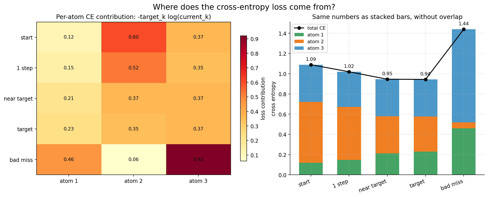

# 交叉熵的点积直觉：target 与 surprise 的加权平均

> 结论：交叉熵不是两个概率向量 $p_{\text{target}}$ 和 $p_{\text{current}}$ 的普通点积，而是 **target 分布** 和 **current surprise 向量** $-\log p_{\text{current}}$ 的点积。

---

## 公式

设目标分布为：

$$
p_t = [p_t(1), p_t(2), ..., p_t(K)]
$$

当前分布为：

$$
p_c = [p_c(1), p_c(2), ..., p_c(K)]
$$

交叉熵定义为：

$$
H(p_t, p_c)
= -\sum_{k=1}^{K} p_t(k)\log p_c(k)
$$

把负号放进 log 项里：

$$
H(p_t, p_c)
= \sum_{k=1}^{K} p_t(k)\big[-\log p_c(k)\big]
$$

写成向量点积：

$$
\boxed{
H(p_t, p_c)
= p_t \cdot \big[-\log p_c\big]
}
$$

所以交叉熵可以理解为：

$$
\boxed{
\text{target 分布对 current surprise 的加权平均}
}
$$

---

## 什么是 surprise

对某个原子 $k$，current 给出的概率是 $p_c(k)$。它的 surprise 是：

$$
\text{surprise}(k) = -\log p_c(k)
$$

如果 current 很相信这个原子：

$$
p_c(k) \approx 1
\quad\Rightarrow\quad
-\log p_c(k) \approx 0
$$

surprise 很小。

如果 current 几乎不相信这个原子：

$$
p_c(k) \approx 0
\quad\Rightarrow\quad
-\log p_c(k) \to +\infty
$$

surprise 很大。

所以交叉熵不是直接问：

```text
target 和 current 两个概率向量有多同向？
```

而是在问：

```text
如果真实事件按 target 分布发生，
current 平均会有多惊讶？
```

---

## 数值例子

设：

$$
p_t = [0.1, 0.5, 0.4]
$$

$$
p_c = [0.3, 0.3, 0.4]
$$

先算 current surprise：

$$
-\log p_c
= [-\log 0.3,\ -\log 0.3,\ -\log 0.4]
$$

$$
\approx [1.204,\ 1.204,\ 0.916]
$$

交叉熵就是：

$$
H(p_t,p_c)
= [0.1,\ 0.5,\ 0.4]\cdot[1.204,\ 1.204,\ 0.916]
$$

$$
= 0.1\times1.204 + 0.5\times1.204 + 0.4\times0.916
$$

$$
= 1.089
$$

也就是：

```text
target 用 [0.1, 0.5, 0.4] 作为权重，
去平均 current 在每个 atom 上的 surprise。
```

---

## 为什么它比普通点积更适合做 loss

普通概率点积是：

$$
p_t \cdot p_c
= \sum_k p_t(k)p_c(k)
$$

它确实能表达某种相似度，但它不会特别严厉地惩罚：

```text
target 很重的位置，current 给了接近 0 的概率
```

交叉熵会。

例如：

$$
p_t = [0.1,\ 0.5,\ 0.4]
$$

如果 current 是：

$$
p_c = [0.3,\ 0.69,\ 0.01]
$$

第三个原子的 target 很重要：

$$
p_t(3)=0.4
$$

但 current 几乎不相信它：

$$
p_c(3)=0.01
$$

第三项 loss 贡献是：

$$
-p_t(3)\log p_c(3)
= -0.4\log 0.01
$$

$$
= 0.4\times4.605
= 1.842
$$

这会非常大。

直觉上：

```text
target 说：这个位置很重要。
current 说：这个位置几乎不可能。
交叉熵说：这就是严重错误。
```

---

## 在 FastSAC C51 critic 中的意义

FastSAC 的 critic loss 是：

```python
critic_log_probs = F.log_softmax(q_outputs, dim=-1)
critic_losses = -torch.sum(target_distributions * critic_log_probs, dim=-1)
```

其中：

$$
\text{critic\_log\_probs}
= \log p_c
$$

所以：

$$
\text{critic\_loss}
= -\sum_k p_t(k)\log p_c(k)
$$

也就是：

$$
\text{critic\_loss}
= p_t \cdot [-\log p_c]
$$

对应到 C51：

```text
target_distributions:
    Bellman projection 得到的目标 Q 分布

critic_log_probs:
    online critic 当前 Q 分布的 log probability

-critic_log_probs:
    online critic 对每个 Q 原子的 surprise
```

因此 critic loss 的含义是：

```text
target Q 分布把概率质量放在哪些原子上，
就重点检查 online critic 在这些原子上是否给了足够概率。
```

如果某个 Q 原子在 target 中概率很高，但 online critic 给得很低：

$$
p_t(k)\ \text{大},\quad p_c(k)\ \text{小}
$$

那么：

$$
-p_t(k)\log p_c(k)
$$

会变大，loss 会强烈推动 online critic 修正这个位置。

---

## 图像直觉

贡献图：



这张图左边每个格子就是：

$$
-p_t(k)\log p_c(k)
$$

右边把每个 atom 的贡献堆起来，得到总交叉熵：

$$
H(p_t,p_c)=\sum_k -p_t(k)\log p_c(k)
$$

所以可以把交叉熵记成一句话：

```text
交叉熵 = target 权重 · current surprise
```

或者更完整地说：

```text
交叉熵衡量的是：
如果真实 Q 原子按 target distribution 出现，
online critic 当前分布平均会有多惊讶。
```

---

## 和梯度公式的关系

交叉熵的点积直觉解释的是 loss 数值：

$$
L = p_t \cdot [-\log p_c]
$$

当 $p_c=\text{softmax}(z)$ 时，对 logit 的梯度会进一步化简成：

$$
\boxed{
\frac{\partial L}{\partial z_k}
= p_c(k)-p_t(k)
}
$$

这说明：

```text
loss 数值：target 对 current surprise 做加权平均
loss 梯度：current - target，直接给出纠偏方向
```

两者合在一起，就是交叉熵在 C51 critic 里很自然的原因：

1. loss 会重罚 target 重要但 current 漏掉的位置。
2. 梯度会把 current 分布推向 target 分布。
