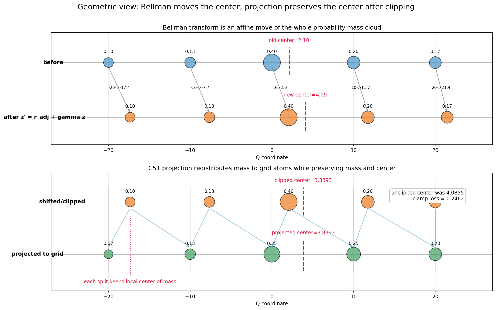
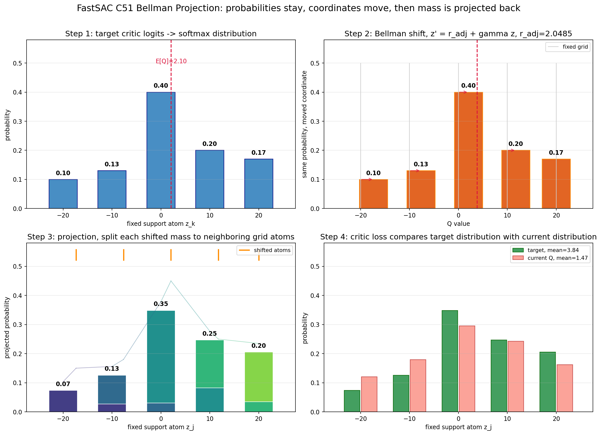

# FastSAC C51 Bellman 投影：数学推导

> 基于 `src/unilab/algos/torch/fast_sac/learner.py` `DistributionalQNetwork.projection()`（第 231-275 行）。

---

## 公式推导

### Step 1：三件互不相干的事

**① 原子坐标**（固定手设，不学习）：

$$
Z = \{z_1, z_2, ..., z_K\}, \quad z_k = v_{\min} + (k-1) \cdot \Delta, \quad \Delta = \frac{v_{\max}-v_{\min}}{K-1}
$$

**② Q 网络输出 logits**（MLP 算出来的 101 个裸分数，可以正负、任意大小）：

$$
\ell_1, \ell_2, ..., \ell_K = Q_{\text{target}}(s', a') \quad \leftarrow \text{MLP 前向，与 } z_k \text{ 无关}
$$

**③ logits 过 softmax 变成概率**（纯数学映射，和原子坐标无关）：

$$
p_k^{\text{next}} = \frac{e^{\ell_k}}{\sum_{j=1}^{K} e^{\ell_j}}, \quad \sum_k p_k^{\text{next}} = 1
$$

之后才把概率和原子组合成期望 Q 值：$Q = \sum_k p_k^{\text{next}} \cdot z_k$。

> **关键：原子 z 是固定坐标，logits 是网络学的置信度，softmax 把置信度变成概率。三者各管各的，只在算期望 Q 值时乘到一起。**

### Step 2：软 Bellman — 把分布整体平移

**问题**：已知 $Q(s',a')$ 的分布，怎么求 target $r + \gamma \cdot Q(s',a')$ 的分布？

**出发公式（软 Bellman 方程）**：

$$
Q(s,a) = r + \gamma \cdot Q(s',a') - \gamma \cdot \alpha \cdot \log\pi(a'|s')
$$

把熵项塞进 reward 里，写成标量 + 缩放的形式：

$$
\underbrace{r_{\text{adj}}}_{\text{调整后奖励}} = r - \gamma \cdot (1-d) \cdot \alpha \cdot \log\pi(a'|s')
$$

$$
Q(s,a) = r_{\text{adj}} + \gamma \cdot Q(s', a')
$$

**关键推导**：标准 Bellman 用标量 Q 值；分布 RL 里，$Q(s',a')$ 是一个**随机变量**，它的分布是：

$$
P\big(Q(s',a') = z_k\big) = p_k^{\text{next}}
$$

那么 $r_{\text{adj}} + \gamma \cdot Q(s',a')$ 也是一个随机变量。$r_{\text{adj}}$ 和 $\gamma$ 是标量（不是随机量），所以：

$$ \boxed{P\big(r_{\text{adj}} + \gamma \cdot Q(s',a') = r_{\text{adj}} + \gamma \cdot z_k\big) = p_k^{\text{next}}} $$

**每个概率 $p_k$ 不动，只是它所附着的原子坐标从 $z_k$ 移到了 $r_{\text{adj}} + \gamma \cdot z_k$：**

$$
z_k^{\text{new}} = r_{\text{adj}} + \gamma \cdot (1-d) \cdot z_k, \quad p_k^{\text{new}} = p_k^{\text{next}}, \quad \forall k
$$

**用期望值验算**（线性性的体现）：

$$
\mathbb{E}\big[r_{\text{adj}} + \gamma \cdot Q(s',a')\big]
= r_{\text{adj}} + \gamma \cdot \mathbb{E}\big[Q(s',a')\big]
= r_{\text{adj}} + \gamma \cdot \sum_k p_k z_k
= \sum_k p_k (r_{\text{adj}} + \gamma \cdot z_k)
= \mathbb{E}\big[Z^{\text{new}}\big]
$$

> 概率不动，每个原子的坐标单独平移+缩放。

### Step 3：投影 — 把跑偏的分布拉回固定格子

**问题**：Step 2 得到的新原子 $z_k^{\text{new}}$ 不在老原子 $z_j$ 上了。

老原子是固定网格：`[-20, -19.6, ..., +20]`，间距 0.4。$r + \gamma \cdot z_k$ 算出来的值几乎不会是 0.4 的整数倍。

**但 Q 网络的输出格式是固定在 101 个老原子上的。** 必须把概率分布重新表达回老原子上。

**做法**：对于每个新原子 $z_k^{\text{new}}$，把它的概率 $p_k$ **按距离拆开**，分给最近的左右两个老原子。

画在坐标轴上：

```
老原子网格:   z₀=-20    z₁=-19.6    z₂=-19.2   ···
               │          │           │
新原子:          z_k^new = -17.35  ← Bellman 平移后跑到这里了
               │          │           │
        它落在 z₆=-17.6 和 z₇=-17.2 之间

距离左边的 z₆:  |-17.35 - (-17.6)| = 0.25  → 近，分更多
距离右边的 z₇:  |-17.35 - (-17.2)| = 0.15  → 远，分更少
```

**公式**：先算归一化位置 $b_k \in [0, K-1]$，再找左右邻居索引：

$$
b_k = \frac{z_k^{\text{new}} - v_{\min}}{\Delta}, \quad
l_k = \lfloor b_k \rfloor \;\text{(左邻居索引)}, \quad
u_k = \lceil b_k \rceil \;\text{(右邻居索引)}
$$

$b_k - l_k \in [0,1)$ 是**离右邻居的距离比例**，$u_k - b_k$ 是**离左邻居的距离比例**。越近分越多：

$$
\begin{aligned}
\text{分给左邻居 } z_{l_k}\text{:}&\quad p_k \cdot (u_k - b_k) \quad\leftarrow \text{离右边越近，} u_k-b_k \text{ 越小，分给左边越少} \\
\text{分给右邻居 } z_{u_k}\text{:}&\quad p_k \cdot (b_k - l_k) \quad\leftarrow \text{离右边越近，} b_k-l_k \text{ 越大，分给右边越多}
\end{aligned}
$$

从全零数组 $p^{\text{target}} = [0, 0, ..., 0]$ 开始，对每个 k 把 $p_k$ 拆到 $p_{l_k}^{\text{target}}$ 和 $p_{u_k}^{\text{target}}$ 上。遍历完所有 101 个 k 后，$p^{\text{target}}$ 就是老原子上的目标分布。

### Step 4：Critic loss

`target_distributions` 是由 target critic、reward、折扣和投影共同构造出的 Bellman target。它在 `torch.no_grad()` 中生成，不反向更新 target critic；真正被梯度更新的是 online critic。

$$
L_Q = -\sum_{j=1}^{K} p_j^{\text{target}} \cdot \log\left(\text{softmax}\big(Q(s, a)\big)_j\right)
$$

### 一链串起来

$$
\boxed{
(s', a') \xrightarrow{Q_{\text{target}}} \{p_k\} \xrightarrow{r+\gamma\cdot(\cdot)} \{z_k^{\text{new}}, p_k\} \xrightarrow{\text{线性投影}} \{p_j^{\text{target}}\} \xrightarrow{\text{交叉熵}} L_Q
}
$$

---

## 完整数值推导（5 原子简化版）

### 给定数据

```
r = 2.0,  done = 0,  γ = 0.97,  α = 0.1
next_log_prob = -0.5
原子间距 Δ = 10
q_support = [-20, -10, 0, 10, 20]
```

### Step 1：Target Q 网络输出

```
原子坐标（固定）: z = [-20, -10, 0, 10, 20]
Q_target(s', a') → MLP → logits = log([0.10, 0.13, 0.40, 0.20, 0.17])
                            ↓ softmax（与 z_k 无关）
                        probs = [0.10, 0.13, 0.40, 0.20, 0.17]
                            ↓ Σ probs · z
Q_target = 0.10×(-20) + 0.13×(-10) + 0.40×0 + 0.20×10 + 0.17×20 = 2.1
```

### Step 2：熵调整

```
adjusted_r = 2.0 - 0.97 × 1.0 × 0.1 × (-0.5)
           = 2.0 + 0.0485 = 2.0485
```

### Step 3：逐原子 Bellman 变换

| k | 原子 $z_k$ | 概率 $p_k$ | $z_k^{\text{new}} = r_{\text{adj}} + \gamma z_k$ |
|---|-----------|-----------|--------------------------------------------------|
| 0 | -20 | 0.10 | 2.0485 + 0.97×(-20) = **-17.3515** |
| 1 | -10 | 0.13 | 2.0485 + 0.97×(-10) = **-7.6515** |
| 2 | 0 | 0.40 | 2.0485 + 0.97×0 = **2.0485** |
| 3 | 10 | 0.20 | 2.0485 + 0.97×10 = **11.7485** |
| 4 | 20 | 0.17 | 2.0485 + 0.97×20 = 21.4485 → clamp 到 **20.0** （信息丢失了一部分）|

### Step 4：投影回老原子

以 `-17.3515` 为例（位于 -20 和 -10 之间）：

```
b = (-17.3515 - (-20)) / 10 = 0.26485
lower = 0 → 原子 0 (-20),  weight = 1 - 0.26485 = 0.73515
upper = 1 → 原子 1 (-10),  weight = 0.26485

分给 -20: 0.10 × 0.73515 = 0.0735
分给 -10: 0.10 × 0.26485 = 0.0265
```

全部投影结果：

| 老原子 | 分配来源 | 总概率 |
|--------|---------|--------|
| **-20** | -17.35 的 73.5% | 0.0735 |
| **-10** | -17.35 的 26.5% + -7.65 的 76.5% | 0.1260 |
| **0** | -7.65 的 23.5% + 2.05 的 79.5% | 0.3486 |
| **10** | 2.05 的 20.5% + 11.75 的 82.5% | 0.2469 |
| **20** | 11.75 的 17.5% + clamp 部分 | 0.2050 |

校验：0.0735 + 0.1260 + 0.3486 + 0.2469 + 0.2050 = **1.0000** ✓

注意：clamp 前的 Bellman 均值是 `r_adj + γ·Q_target = 4.0855`；最后一个新原子 `21.4485` 被截断到 `20.0` 后，投影分布的均值变成 `3.8393`。这就是 C51 固定支撑区间的边界信息损失。

### Step 5：Critic loss

```
p_target = [0.0735, 0.1260, 0.3486, 0.2469, 0.2050]   ← 目标分布
p_current = softmax(Q_current(s, a))                    ← 当前 Q 输出

L_Q = -Σ p_target · log(p_current)                     ← 交叉熵
```

---

## 核心代码对应

```python
# 第 245 行：逐原子 Bellman 平移
target_z = rewards.unsqueeze(1) + bootstrap.unsqueeze(1) * discount.unsqueeze(1) * q_support

# 第 247-249 行：算新坐标落在哪两个老原子之间
b = (target_z - v_min) / delta_z
lower = torch.floor(b).long()
upper = torch.ceil(b).long()

# 第 273-274 行：线性插值投影
proj_dist.view(-1).index_add_(0, lower_indices, (next_dist * (upper - b)).view(-1))
proj_dist.view(-1).index_add_(0, upper_indices, (next_dist * (b - lower)).view(-1))

# 第 617-618 行：交叉熵 loss
critic_losses = -torch.sum(target_distributions * critic_log_probs, dim=-1)
```

> **核心：Bellman 算子是线性的，$r + \gamma \cdot \sum p_k z_k = \sum p_k (r + \gamma z_k)$（概率之和为1，$\sum p_kr=r$）。概率不动，原子平移，投影回固定格子，最后和当前 Q 分布做交叉熵。**

---

## 纯数学和几何意义

把 C51 分布看成数轴上的离散概率测度：

$$
\mu = \sum_{k=1}^{K} p_k \delta_{z_k}
$$

其中 $z_k$ 是位置，$p_k$ 是这个位置上的概率质量，$\delta_{z_k}$ 表示集中在 $z_k$ 的点质量。这个分布的总质量和重心分别是：

$$
\sum_{k=1}^{K} p_k = 1
$$

$$
\mathbb{E}_{\mu}[Z] = \sum_{k=1}^{K} p_k z_k
$$

### Bellman 变换是仿射变换

不考虑 clamp 时，软 Bellman 对每个原子做同一个仿射变换：

$$
T(z) = r_{\text{adj}} + \gamma z
$$

因此 Bellman 后的新分布是 pushforward distribution：

$$
T_{\#}\mu
= \sum_{k=1}^{K} p_k \delta_{T(z_k)}
= \sum_{k=1}^{K} p_k \delta_{r_{\text{adj}}+\gamma z_k}
$$

它的概率质量没有变，只是每个质量所在的位置被移动了。因为 $T$ 是仿射函数，重心也按同样的方式移动：

$$
\mathbb{E}_{T_{\#}\mu}[Z]
= \sum_{k=1}^{K} p_k (r_{\text{adj}}+\gamma z_k)
$$

$$
= r_{\text{adj}} \sum_{k=1}^{K} p_k + \gamma \sum_{k=1}^{K} p_k z_k
$$

$$
= r_{\text{adj}} + \gamma \mathbb{E}_{\mu}[Z]
$$

这说明两种做法在“期望 Q 值”上等价：

$$
\boxed{
\sum_{k=1}^{K} p_k (r_{\text{adj}}+\gamma z_k)
= r_{\text{adj}}+\gamma \sum_{k=1}^{K} p_k z_k
}
$$

但 C51 不能只保留右边那个标量，因为右边只保留重心，会丢掉分布形状。逐原子 Bellman 保留的是整个分布：

$$
\{(z_k,p_k)\}_{k=1}^{K}
\quad\longrightarrow\quad
\{(r_{\text{adj}}+\gamma z_k,p_k)\}_{k=1}^{K}
$$

### 投影是保持局部重心的线性插值

Bellman 后的新位置 $x_k = r_{\text{adj}}+\gamma z_k$ 通常不落在固定 support 上。设它位于两个相邻原子之间：

$$
z_l \le x_k \le z_u
$$

其中：

$$
b_k = \frac{x_k-v_{\min}}{\Delta}, \quad l=\lfloor b_k \rfloor,\quad u=\lceil b_k \rceil
$$

投影时，把 $p_k$ 拆成左右两部分：

$$
m_l = p_k (u-b_k), \quad m_u = p_k (b_k-l)
$$

总质量保持：

$$
m_l + m_u
= p_k(u-b_k) + p_k(b_k-l)
= p_k(u-l)
= p_k
$$

当 $u=l+1$ 时，局部重心也保持。因为 $x_k = z_l + (b_k-l)\Delta$，且 $z_u=z_l+\Delta$：

$$
m_l z_l + m_u z_u
= p_k(u-b_k)z_l + p_k(b_k-l)z_u
$$

$$
= p_k\left[(u-b_k)z_l + (b_k-l)(z_l+\Delta)\right]
$$

$$
= p_k\left[z_l + (b_k-l)\Delta\right]
= p_k x_k
$$

所以不考虑 clamp 时，每个移动后的原子在投影前后都满足：

$$
\boxed{
p_k x_k
= m_l z_l + m_u z_u
}
$$

对所有 $k$ 求和，整个分布投影前后的期望也保持：

$$
\boxed{
\sum_k p_k x_k
= \sum_j p_j^{\text{target}} z_j
}
$$

因此几何上可以这样理解：

1. **Bellman 变换**：把整团概率质量云做缩放和平移。
2. **C51 投影**：把落在格子缝里的质量按距离拆到左右格点。
3. **不考虑 clamp**：投影保持总质量和重心，所以投影前后的期望 Q 一致。
4. **考虑 clamp**：超过 $[v_{\min}, v_{\max}]$ 的部分会被截到边界，重心会发生损失。

### 投影不是完整分布等价

上面的“保持重心”不要理解成“投影前后的分布完全一样”。C51 投影保持的是：

$$
\sum_j p_j^{\text{target}} = 1
$$

以及不考虑 clamp 时的期望：

$$
\sum_j p_j^{\text{target}} z_j = \sum_k p_k x_k
$$

但它会改变真实分布的形状。比如一个移动后的点质量：

$$
0.10 \cdot \delta_{-17.3515}
$$

投影回固定 support 后会变成：

$$
0.0735 \cdot \delta_{-20} + 0.0265 \cdot \delta_{-10}
$$

这两个分布的期望相同：

$$
0.10 \times (-17.3515)
= 0.0735 \times (-20) + 0.0265 \times (-10)
$$

但它们不是同一个分布。投影后的质量被拆散到两个网格点上，方差、局部分布形状、距离意义上的真实位置都发生了变化。

所以更严谨的说法是：

$$
\boxed{
\text{C51 投影是在固定 support 上的近似表达；它保持总质量和期望，但不保持完整分布形状。}
}
$$

这也是 C51 的核心取舍：

1. 相比普通标量 Q，C51 保留了更多 return distribution 信息。
2. 相比真实连续分布，C51 只能用固定数量的原子做近似。
3. support 越粗，投影误差越明显；support 边界不够宽时，还会出现 clamp 带来的额外信息损失。

### 几何图



上图上半部分展示 Bellman 仿射变换如何把整团概率质量云移动；下半部分展示 C51 投影如何把新位置上的概率质量拆回固定网格，并保持 clamp 后的重心。

---

## 配套可视化

运行：

```bash
uv run python tutorial/visualize_c51_projection.py
```

会生成：

```text
tutorial/imagefastsac/c51_bellman_projection.png
tutorial/imagefastsac/c51_bellman_geometry.png
```

四步图：



这张图分四块看：

1. **Step 1**：固定原子上的 next Q 概率分布，logits 只是网络输出的置信度。
2. **Step 2**：Bellman 变换后，概率柱子的高度不变，横坐标整体被 `r_adj + γz` 移动。
3. **Step 3**：移动后的原子通常不在固定格子上，所以按距离把概率拆给左右邻居。
4. **Step 4**：投影出来的 target 分布和当前 critic 分布做交叉熵。

几何图：


这张图重点看两个重心：

1. Bellman 变换前，旧分布重心是 `2.10`。
2. 不 clamp 的 Bellman 变换后，重心是 `4.0855`。
3. clamp 后，重心变成 `3.8393`。
4. 投影回固定网格后，重心仍是 `3.8393`。

脚本还会在终端打印逐原子拆分表，最适合对照投影公式看。
