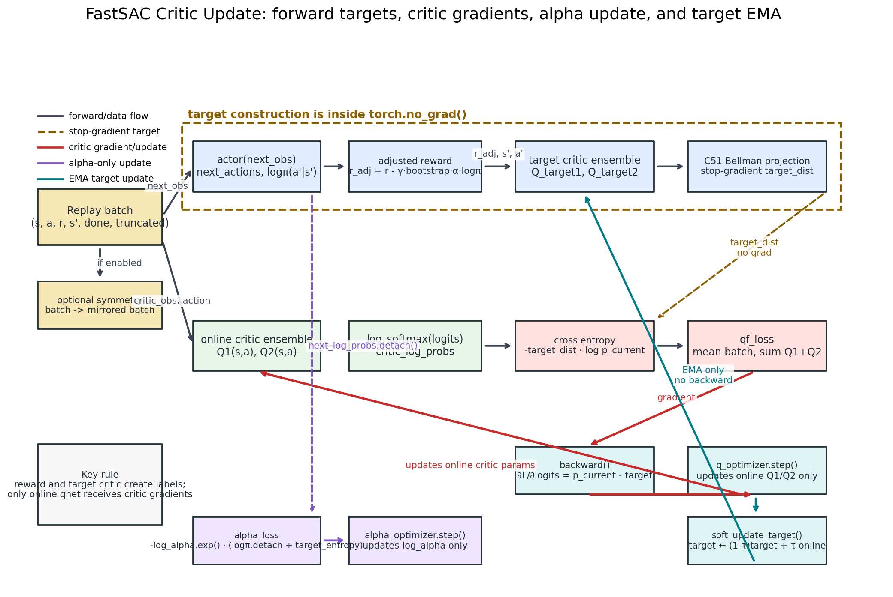

# FastSAC Critic：梯度传播和参数更新全链路

> 基于 `src/unilab/algos/torch/fast_sac/learner.py` 中 `FastSACLearner._critic_loss_tensors()`、`update_critic()` 和 `soft_update_target()`。

---

## 总览图



图里颜色含义：

```text
灰色实线：普通 forward / data flow
棕色虚线：target distribution，stop-gradient
红色实线：critic loss 的反向传播和 online critic 参数更新
紫色虚线：alpha 温度参数更新
青色实线：target critic 的 EMA 软更新
```

---

## Critic 里有哪些网络

默认：

```python
num_q_networks = 2
```

所以 FastSAC critic 部分有两组 critic ensemble：

```text
self.qnet
  online critic ensemble，真正通过 qf_loss 更新
  ├── online Q1
  └── online Q2

self.qnet_target
  target critic ensemble，不反向传播
  ├── target Q1
  └── target Q2
```

初始化时：

```python
self.qnet_target.load_state_dict(self.qnet.state_dict())
```

之后：

```text
online Q1/Q2：由 critic loss 反向传播更新
target Q1/Q2：由 soft_update_target() 慢慢追 online Q1/Q2
```

---

## Step 1：从 batch 取数据

`update_critic()` 从 replay buffer batch 里取：

```python
obs = batch["obs"]
critic_obs = batch["critic"]
actions = batch["actions"]
rewards = batch["rewards"]
next_obs = batch["next_obs"]
critic_next_obs = batch["next_critic"]
dones = batch["dones"]
truncated = batch["truncated"]
```

如果开启 symmetry augmentation，会把 batch 扩成：

```text
原始样本 + 左右镜像样本
```

这只是数据增强，不改变下面的梯度规则。

---

## Step 2：构造 bootstrap 和 discount

```python
bootstrap = torch.clamp(1.0 - dones.float() + truncated.float(), 0.0, 1.0)
discount = torch.full_like(dones, self.gamma)
```

含义：

```text
done=True       -> 不 bootstrap 下一步 Q
truncated=True  -> 时间截断，不当成真实终止，仍允许 bootstrap
```

---

## Step 3：target 构造在 `torch.no_grad()` 里

核心代码：

```python
with torch.no_grad():
    next_actions, next_log_probs, _ = self._get_actions_and_log_probs_for_critic(
        next_obs,
        critic_next_obs,
    )

    adjusted_rewards = (
        rewards - discount * bootstrap * self.log_alpha.exp() * next_log_probs
    )

    target_distributions = self.qnet_target.projection(
        critic_next_obs, next_actions, adjusted_rewards, bootstrap, discount
    )
```

这一步做三件事：

1. actor 在下一状态 `s'` 采样动作 `a'`。
2. 用 SAC 熵项修正 reward：

$$
r_{\text{adj}}
= r - \gamma \cdot \text{bootstrap} \cdot \alpha \cdot \log\pi(a'|s')
$$

3. target critic 估计下一步分布，并做 C51 Bellman projection：

$$
Z_{\text{target}}
= r_{\text{adj}} + \gamma \cdot \text{bootstrap} \cdot Z_{\text{target critic}}(s',a')
$$

因为整段在：

```python
with torch.no_grad():
```

里面，所以这条链路不会更新：

```text
actor
target critic
log_alpha
```

它只是在生成 critic 的训练标签：

```text
target_distributions
```

---

## Step 4：online critic 输出当前分布

```python
q_outputs = self.qnet(critic_obs, actions)
critic_log_probs = F.log_softmax(q_outputs, dim=-1).clamp(min=-30.0)
```

这里：

```text
self.qnet = online critic ensemble
```

输出形状可理解为：

```text
[num_q_networks, batch, num_atoms]
```

默认：

```text
[2, batch, 101]
```

也就是：

```text
online Q1(s,a) -> 101 个 atom logits
online Q2(s,a) -> 101 个 atom logits
```

经过 `log_softmax` 后：

```text
critic_log_probs = log p_current
```

---

## Step 5：critic loss 是 target 和 current 的交叉熵

代码：

```python
critic_losses = -torch.sum(target_distributions * critic_log_probs, dim=-1)
qf_loss = critic_losses.mean(dim=1).sum(dim=0)
```

数学上：

$$
L_Q
= -\sum_k p_{\text{target}}(k)\log p_{\text{current}}(k)
$$

也就是：

$$
L_Q
= p_{\text{target}} \cdot [-\log p_{\text{current}}]
$$

对两个 Q 网络分别算：

```text
loss_Q1 = CE(target_dist_Q1, online_dist_Q1)
loss_Q2 = CE(target_dist_Q2, online_dist_Q2)
```

然后：

```text
qf_loss = mean_batch(loss_Q1) + mean_batch(loss_Q2)
```

---

## Step 6：critic 反向传播只更新 online Q1/Q2

代码：

```python
self.q_optimizer.zero_grad(set_to_none=True)
qf_loss.backward()
self._reduce_gradients(self.qnet)
self.q_optimizer.step()
```

梯度链路是：

```text
qf_loss
  -> critic_log_probs
  -> log_softmax(q_outputs)
  -> q_outputs = self.qnet(critic_obs, actions)
  -> self.qnet parameters
```

所以被更新的是：

```text
online Q1
online Q2
```

不会被更新的是：

```text
target Q1/Q2
actor
log_alpha
```

交叉熵 + softmax 的关键梯度是：

$$
\frac{\partial L_Q}{\partial z_k}
= p_{\text{current}}(k)-p_{\text{target}}(k)
$$

因此 critic 更新的直觉是：

```text
online critic 当前哪个 atom 概率太高，就压低；
哪个 atom 概率太低，就推高；
直到 online 分布靠近 Bellman target 分布。
```

---

## Step 7：alpha loss 是单独的一条更新链

代码：

```python
alpha_loss = (-self.log_alpha.exp() * (next_log_probs + self.target_entropy)).mean()
alpha_loss.backward()
self.alpha_optimizer.step()
```

注意 `_critic_loss_tensors()` 返回的是：

```python
next_log_probs.detach()
```

所以 alpha loss 的梯度只更新：

```text
log_alpha
```

不会回传到 actor。

这条链路控制探索温度：

```text
alpha 大 -> 更鼓励 entropy
alpha 小 -> 更偏向利用高 Q action
```

---

## Step 8：target critic 由 EMA 软更新

代码：

```python
with torch.no_grad():
    for tgt, src in zip(self.qnet_target.parameters(), self.qnet.parameters()):
        tgt.data.mul_(1.0 - self.tau).add_(src.data, alpha=self.tau)
```

数学上：

$$
\theta_{\text{target}}
\leftarrow
(1-\tau)\theta_{\text{target}} + \tau\theta_{\text{online}}
$$

所以：

```text
target Q1 慢慢追 online Q1
target Q2 慢慢追 online Q2
```

它不是通过 loss 更新，也不反向传播。

---

## 一句话总结

```text
target critic + reward + actor(next_obs) 负责造 Bellman target distribution；
online critic 负责输出 current distribution；
critic loss 用交叉熵比较两者；
反向传播只更新 online Q1/Q2；
alpha 用自己的 loss 单独更新；
target critic 用 EMA 慢慢追 online critic。
```

最重要的梯度边界：

```text
target construction: no_grad，不更新 target critic / actor
critic loss backward: 只更新 self.qnet
alpha loss backward: 只更新 log_alpha
soft_update_target: 只做参数 EMA，不是梯度
```
