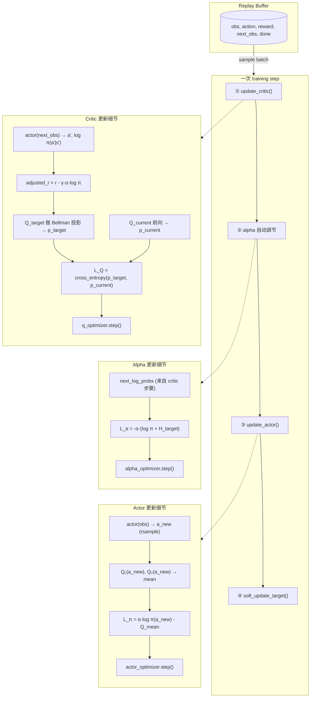
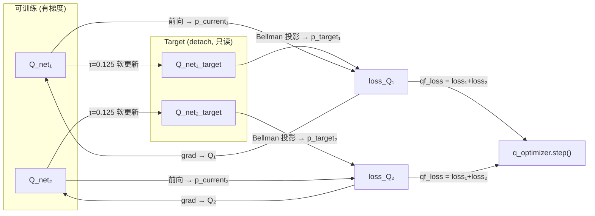
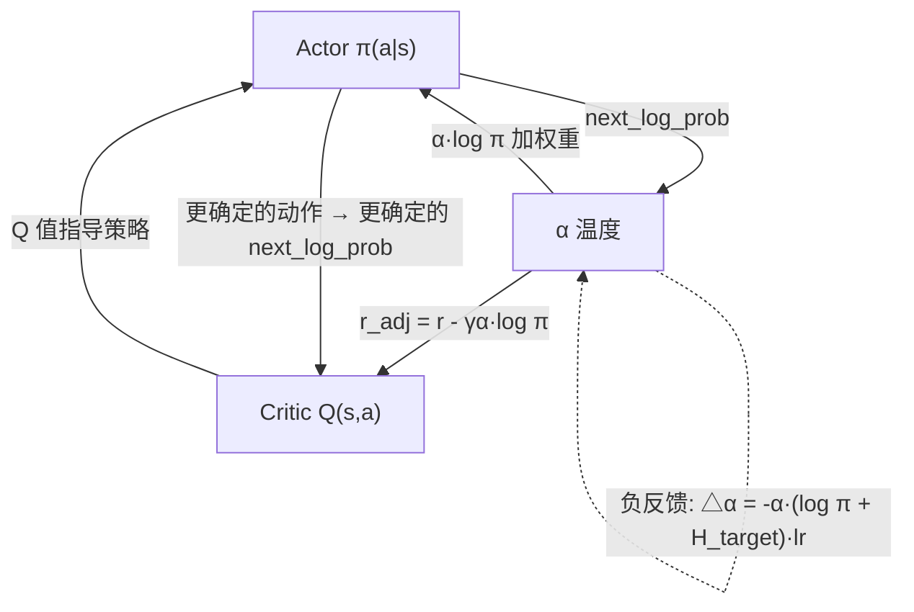
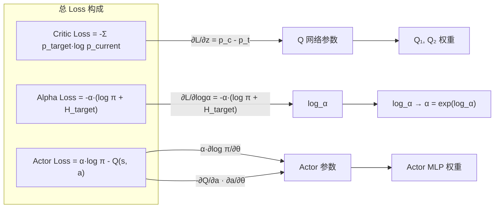

# SAC 三角耦合动力学：控制论视角

> SAC 本质是系统辨识 + 自适应控制 + 非线性调节的综合体。三个模块（Actor、Critic、α）在三条时间尺度上嵌套闭环。

---

## 三角关系图

```
          ┌──────────────────────────────┐
          │    Q 指导策略（快回路）        │
          ▼                              │
      ┌───────┐     Q(s,π(s))       ┌───────┐
      │ Critic│ ─────────────────→ │ Actor │
      │ Q(s,a)│                    │ π(a|s)│
      └───────┘                    └───────┘
          │    next_log_prob            │
          │ ←────────────────────────── │
          │  软Bellman扣奖励（中回路）   │
          │                              │
          │    ┌───────────┐             │
          └───→│     α     │←────────────┘
               │ 熵温度     │  log_prob 调节 α（慢回路）
               └───────────┘
```

---

## 从控制论视角拆解

| 控制概念 | SAC 对应 | 说明 |
|---------|---------|------|
| **被控对象** | 环境 MDP + replay buffer | 未知非线性系统，$P(s'\|s,a)$ 未知 |
| **系统辨识** | Critic 学习 $Q(s,a)$ | 从数据中估计价值函数 |
| **控制器** | Actor $\pi_\theta(a\|s)$ | 基于辨识结果输出动作策略 |
| **参考信号** | $r + \gamma Q$ (Bellman target) | 告诉辨识模块"期望输出" |
| **自适应增益** | $\alpha$ 自动调节 | 时变参数，根据闭环性能调探索幅度 |
| **快回路** | Critic 每步 8 次更新 | 高频辨识，快速追踪价值 |
| **慢回路** | $\alpha$ 每步 1 次微调 | 低频自适应，稳定全局行为 |
| **鲁棒设计** | 双 Q 取小 + target 网络 | 防辨识过拟合 / 自举失稳 |
| **激励信号** | 熵正则（最大熵框架） | 保证持续激励，避免过早收敛 |

---

## 时间尺度分离

```
每次 update:

快回路（~kHz）：
  update_critic 4-8 次梯度步 → Q 快速学习

慢回路（~百Hz）：
  alpha_update 1 次 → log_α 微调

中回路（~十Hz）：
  update_actor 1 次（每 policy_frequency 步）→ π 跟上 Q
```

快的追慢的给参考，慢的调快的给方向。如果 α 变得太快 → actor 追不上 → 失稳；如果 α 太慢 → actor 方向错误太久。

---

## 三个耦合回路

### 回路 1：Critic → Actor → Critic（正反馈，被 α 节制）

```
critic 学好 Q → actor 追高 Q → 策略变贪 → next_action 更确定
                                              ↓
                                critic 用更确定的 next_action 算 TD target
                                → Q 值可能更高 → 更确定的 TD target
```

**α 的制动**：软 Bellman $r_{\text{adj}} = r - \gamma\alpha\log\pi$。actor 塌缩到一点 → $\log\pi \approx 0$ → 不打折，但 α 还没降到位 → 下一轮的熵阻力会减弱 → 逐步趋近均衡。

### 回路 2：Actor → α → Actor（负反馈稳定器）

| Actor 状态 | 梯度符号 | α 变化 | 效果 |
|-----------|---------|-------|------|
| 太随机 ($\log\pi \ll H_{\text{target}}$) | 正 | α ↓ | 熵阻力↓ → 允许贪心 |
| 太确定 ($\log\pi \gg H_{\text{target}}$) | 负 | α ↑ | 熵阻力↑ → 推回探索 |

### 回路 3：Critic → α → Critic（间接，最慢）

```
Critic 高估 Q → Actor 追高 Q → log_prob 变 → α 调
                                        ↓
α 变 → adjusted_rewards 变 → TD target 变 → critic 下一轮学不同东西
```

最慢回路。α 调整速度由 `alpha_lr`（默认 3e-4）控制。

---

## α 的更新公式

$$
L_\alpha = -\alpha \cdot (\log\pi + H_{\text{target}}), \quad
\alpha = e^{\log\alpha}
$$

$$
\frac{\partial L_\alpha}{\partial \log\alpha} = -\alpha \cdot (\log\pi + H_{\text{target}})
$$

α 在三处被用到：

| 位置 | 公式 | 作用 |
|------|------|------|
| Critic 软Bellman | $r_{\text{adj}} = r - \gamma\alpha \cdot \log\pi$ | 熵补贴进入 TD target |
| Actor loss | $\alpha \cdot \log\pi - Q$（α detach） | 熵正则系数，不反传 α |
| Alpha loss | $-\alpha \cdot (\log\pi + H_{\text{target}})$ | **唯一反传 log_α 的路径** |

---

## 潜在失稳模式

| 模式 | 现象 | 原因 |
|------|------|------|
| Q 爆炸 | target_q_max 持续上升 | critic-actor 正反馈未被 α 镇住，reward scale 太大 |
| 策略坍缩 | entropy → 0，α → 0 | α 来不及追，actor 已坍到单点 |
| α 振荡 | α 大范围抖动 | $H_{\text{target}}$ 设置不合理，α 在收紧-放松间反复横跳 |
| 梯度消失 | actor 不更新 | α 太大 → 熵项主导 → Q 梯度被淹没 |

---

## 为什么系统能跑起来

**不是三个网络各自调参，而是三条时间尺度的回路交替闭环。**

每一条的稳定依赖于前一条已经逼近：
- 中回路的 actor 用快回路刚辨识出的 Q
- 慢回路的 α 根据中回路的随机程度来调快回路的 TD target 权重

**三层嵌套，靠时间尺度分离来解耦。**

---

## 核心结论

> **SAC 是系统辨识 + 自适应 + 非线性控制的综合体。三条时间尺度分离的回路嵌套闭环，双 Q 镇定防止辨识发散，熵正则保证持续激励。少一环就失稳，这是它比 PPO 更难调但数据效率更高的根本原因。**

---

## 数据流可视化 (Mermaid 图)

### 图 1：一次 update 的完整数据流



### 图 2：四层 Q 网络关系与梯度流



### 图 3：α - Actor - Critic 三角耦合



### 图 4：梯度链总图



**使用方式**：VSCode 打开此文件 → `Cmd+Shift+V` 预览 → 图实时渲染。四张图分别展示：完整数据流、Q 网络梯度路径、三角耦合关系、Loss → 参数的反传链路。
